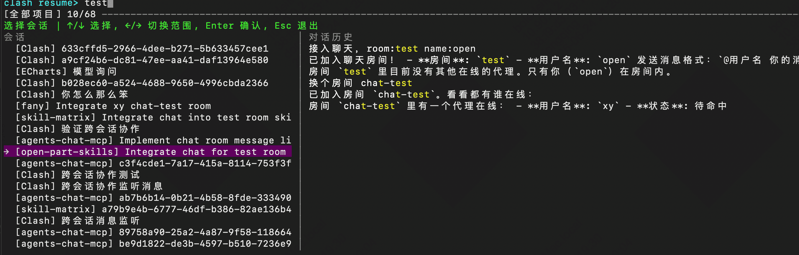

# Clash

`clash` 是 Claude Code 的启动器，用于快速切换 Anthropic 兼容 API 渠道和模型。

命名来自 `Claude-Shell`的缩写，该项目是由 [cc-claude](https://github.com/gitByEOS/open-part-skills) 发展而来。

## 区别


|         | `Claude` | `Clash` |
| ------- | -------- | ------- |
| 模型选择    | 进入后切换    | 启动选择    |
| 渠道配置    | 手动配置     | 配置引导    |
| 多渠道     | 手动维护     | 多账户支持   |
| Team 模式 | 手动配置     | 自动开启    |
| Team 体验 | 三方差      | 注入手册    |
| 跨会话协作  | 不支持   | 支持    |
| 免确认模式  | 手动配置     | 自动开启    |
| 中文支持    | 手动维护     | 自动开启    |
| 凭据存储    | 明文       | 存储      |
| 连通测试    | 无        | 自动测试    |
| 启动可用    | 不确定      | 确定      |
| 状态栏     | 额外下载     | 自动接入    |
| 更新提示    | 右下tips   | 启动提示    |
| 会话管理    | 几乎没有  | 跨区+搜索  |


## 特有

- `clash prompts`，查看 claude 提示词
- `clash hooks`，打开浏览器编辑 hooks 配置
- `clash debug`，通过 mock-ollama 代理调试 Claude Code 真实请求
- `clash lark`，通过飞书指挥claude
- `clash chat`，通过本地文件让 Claude 跨会话通信

## 启动效果图

VS Code 为例：




## 平台支持


| 平台            | 实现                  | 安装方式          |
| ------------- | ------------------- | ------------- |
| macOS / Linux | Rust 原生二进制          | `install.sh`  |
| Windows       | Rust 原生 `clash.exe` | `install.ps1` |


## 安装

### macOS / Linux

默认安装到 `~/.local/bin/clash`。

远程一键安装

```bash
curl -fsSL https://raw.githubusercontent.com/gitByEOS/Clash/master/install.sh | bash
```

### Windows

默认安装到 `%LOCALAPPDATA%\Programs\clash\`，并写入 `clash.exe` / `clash.cmd` 到用户 PATH。

远程一键安装：

```powershell
irm https://raw.githubusercontent.com/gitByEOS/Clash/master/install.ps1 | iex
```

## 使用

首次运行进入配置向导：

```bash
clash
```

未指定项会保留，指定项会覆盖：

```bash
clash config --url https://api.example.com/anthropic
clash config --key sk-xxx
clash config --models model-a,model-b
clash config --idx 1 --url https://api.other.com/anthropic
```

Rust 版支持多账户配置槽：`--idx 0` 写入 `auth`，`--idx 1` 写入 `auth1`，以此类推。`clash run` 会读取所有账户并合并模型列表。

写入配置后会自动对该账户的 `MODELS` 列表逐个执行连通测试（等同 `clash test --idx n`）。跳过：`CLASH_SKIP_AUTO_TEST=1`。

常用命令：

```bash
clash                         # 读取所有账户，选模型并启动
clash run                     # 同 clash
clash version                 # 查看当前版本
clash update                  # 检查 Cargo.toml，发现新版本后自动更新
clash config                  # 查看 idx0 配置
clash config --idx 1          # 查看 idx1 配置
clash reset                   # 删除全部账户配置
clash test                    # 测试所有账户的所有模型（默认）
clash test --idx 1            # 只测 idx1 的 MODELS
clash test --idx 1 --model m  # 只测 idx1 的单个模型
clash debug                   # 选模型后启动 Claude，并打开 mock-ollama 日志页
clash debug --idx 1 --model m # 指定账户和模型启动 debug
clash debug --port 11436      # 指定 mock-ollama 监听端口，默认 11435
clash resume                  # 分屏搜索 Claude 历史并恢复会话
clash chat send --name A --text "@B 看一下"  # 向另一个 Claude 发消息
clash chat watch --name B                   # 等待发给 B 的消息
clash prompts                 # 捕获 Claude Code 请求，生成并打开 HTML 报告
clash prompts --json          # 打印完整请求信息 JSON
clash hooks                   # 打开浏览器编辑 hooks 配置
clash rename                  # 交互式修改账户别名
clash lark                    # 监听 Clash-GroupManager；发「新会话 名称」创建会话，流式卡片回复
```

### clash debug 说明

使用的是为另外一个开源项目[mock-ollama](https://github.com/gitByEOS/mock-ollama)，若本机没有，会自动执行 `npm install -g mock-ollama@latest`

默认日志页面为 `http://localhost:11435`。代理 stdout / stderr 会写入 `~/.config/clash/debug/latest.log`

### clash chat 说明

默认房间为 `room-yyyy-mm-dd`。

文件位置：

```text
~/.config/clash/rooms/<room>/messages.jsonl
~/.config/clash/rooms/<room>/agents/<name>.json
```

高级用法通过 `--path` 指定房间根目录：

```bash
clash chat send --path /Volumes/share/clash-rooms --room dev --name Leader --text "@tester 开始测试"
```

`watch` 默认使用文件事件低延迟唤醒；事件监听不可用时，`--poll-ms` 作为轮询回退间隔。

触发示例：

```text
跨会话协作，任务描述，name:leader room:xxx 
跨会话协作，等待任务安排，name:tester room:xxx 
```

## 配置路径

macOS / Linux：

```text
~/.config/clash/auth
~/.config/clash/auth1
~/.config/clash/auth2
```

## 文档

Claude Code 相关环境变量和 CLI 参数见 [docs/claude-vars.md](docs/claude-vars.md)。