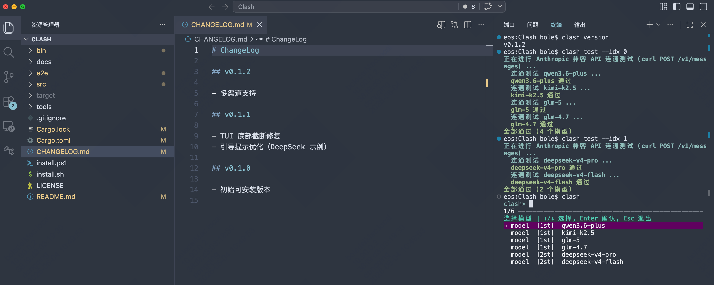

# Clash

`clash` 是 Claude Code 的启动器，用于快速切换 Anthropic 兼容 API 渠道和模型。

命名来自 `Claude-Shell`的缩写，该项目是由 [cc-claude](https://github.com/gitByEOS/open-part-skills) 发展而来。


## 区别

|  | `claude` 启动 |  `clash` 启动 |
|:---:|:---:|:---:|
| 模型选择 | 进入后切换 | 启动 TUI 选择 |
| 渠道配置 | 手动配置 | 配置引导 |
| 多渠道 | 手动维护 | 多账户支持 |
| Team 模式 | 手动配置 | 自动开启 |
| 免确认模式 | 手动配置 | 自动开启 |
| 凭据存储 | 明文 | 存储 |
| 连通测试 | 无 | 自动测试 |
| 启动可用 | 不确定 | 确定 |

## 启动效果图
VS Code 为例：


## 平台支持


| 平台            | 实现                      | 安装方式          |
| ------------- | ----------------------- | ------------- |
| macOS / Linux | Rust 原生二进制              | `install.sh`  |
| Windows       | PowerShell 脚本（需 `pwsh`） | `install.ps1` |


## 安装

### macOS / Linux

默认安装到 `~/.local/bin/clash`。

远程一键安装

```bash
curl -fsSL https://raw.githubusercontent.com/gitByEOS/Clash/master/install.sh | bash
```

### Windows

默认安装到 `%LOCALAPPDATA%\Programs\clash\`，并写入 `clash.cmd` 到用户 PATH。

远程一键安装：

```powershell
irm https://raw.githubusercontent.com/gitByEOS/Clash/master/install.ps1 | iex
```

## 使用

首次运行进入配置向导：

```bash
clash
```

未指定项会保留，指定项会覆盖：

```bash
clash config --url https://api.example.com/anthropic
clash config --key sk-xxx
clash config --models model-a,model-b
clash config --idx 1 --url https://api.other.com/anthropic
```

macOS / Linux 原生二进制支持多账户配置槽：`--idx 0` 写入 `auth`，`--idx 1` 写入 `auth1`，以此类推。`clash run` 会读取所有账户并合并模型列表。

写入配置后会自动对该账户的 `MODELS` 列表逐个执行连通测试（等同 `clash test --idx n`）。跳过：`CLASH_SKIP_AUTO_TEST=1`。

常用命令：

```bash
clash                         # 读取所有账户，选模型并启动
clash run                     # 同 clash
clash version                 # 查看当前版本
clash update                  # 检查 Cargo.toml，发现新版本后自动更新
clash config                  # 查看 idx0 配置
clash config --idx 1          # 查看 idx1 配置
clash reset                   # 删除全部账户配置
clash test                    # 测试 idx0 的 MODELS
clash test --idx 1            # 测试 idx1 的 MODELS
clash test --idx 1 --model m  # 只测 idx1 的单个模型
```

## 配置路径

macOS / Linux：

```text
~/.config/clash/auth
~/.config/clash/auth1
~/.config/clash/auth2
```

Windows：

```text
%APPDATA%\clash\auth
```

## 凭据存储

- **macOS / Linux**：`AUTH_TOKEN` 使用本机 hostname + 用户名派生密钥 AES 加密
- **Windows**：`AUTH_TOKEN` 使用 DPAPI 加密

## 文档

Claude Code 相关环境变量和 CLI 参数见 [docs/claude-vars.md](docs/claude-vars.md)。